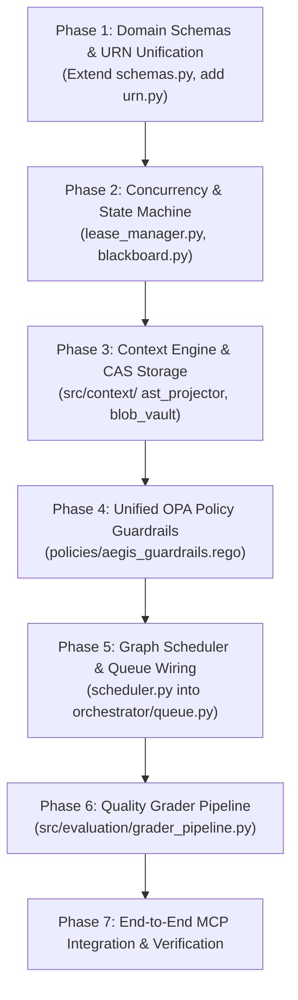

# Aegis MCP: Architecture Convergence & Migration Plan (v0.1.0-Alpha ➔ Target)

**Document ID:** `MIGRATION-001`  
**Status:** READY FOR REVIEW  
**Date:** 2026-10-08  
**Scope:** Reconcile existing implementation (`src/control_plane`, `src/data_plane`, `src/orchestrator`, `src/memory`, `src/autolearn`) with `spec - v0-0-1-alpha.md` without regressing the 208/208 green test suite.

---

## 1. Executive Summary & Convergence Strategy

The repository already contains mature, tested infrastructure that `spec - v0-0-1-alpha.md` omitted:
- **Dual-tier sandboxing:** in-process Monty Python/Rust (`pydantic-monty`) + container-isolated ephemeral gVisor (`runsc`).
- **Resilient routing:** automated multi-tier LLM failover router (`gemini-3.8-flash` ➔ `gemini-3.8-flash-32k` ➔ `gpt-4o`) with backoff and audit headers.
- **Enterprise identity & ingress:** Keycloak OIDC, canonical 4-tuple URN headers, and Envoy AI Gateway config.
- **Episodic memory & learning:** PGVector store with cosine similarity ranking and an arXiv Paper Scout.
- **Telemetry hierarchy:** OpenTelemetry GenAI spans enriched with agent hierarchy and 4-tuple attribution feeding native Perses dashboards.

Conversely, `spec - v0-0-1-alpha.md` introduces missing execution-governance guarantees:
- **Formal state machine:** monotonic `ExecutionPhase` transitions on `TaskBlackboard`.
- **Atomic concurrency control:** `FileLeaseManager` with lease URNs, TTL eviction, and conflict detection.
- **Static context bounds:** stdlib `ASTProjector` symbol digest, $H_{\text{ctx}}$ context health metric, and Content-Addressed `BlobVault`.
- **Parallel scheduling:** Welsh-Powell graph-coloring conflict partitioner (`ConflictGraphDAGScheduler`).
- **4-tier quality gating:** `GraderPipeline` validating linter, verifier, AST complexity, intent score, and turn budgets.

### The Anti-Regression Invariant
**We do not overwrite existing modules with bare stubs.** We converge by extending existing contracts, preserving backward compatibility with `AgentCompositeKey`, `UserContext`, and `ModelFailoverPolicy`.

---

## 2. Structural Diff & Target Directory Layout

```
aegis-mcp/
├── architecture/
│   ├── spec - v0-0-1-alpha.md            # Canonical high-level specification
│   ├── MIGRATION_PLAN.md                  # This migration blueprint
│   └── adr/                               # Formal ADRs (001 through 004)
├── policies/
│   ├── aegis_guardrails.rego              # CONVERGED: replaces separate tool & compliance rego
│   ├── tool_execution.rego                # Retained for legacy MCP endpoints during migration
│   └── agent_handoff.rego                 # Retained for supervisor handoff rules
├── src/
│   ├── control_plane/
│   │   ├── schemas.py                     # EXTENDED: AgentCompositeKey + AegisUrn + TaskBlackboard + FileLease
│   │   ├── urn.py                         # NEW: Canonical AegisUrn validator & parser
│   │   ├── blackboard.py                  # NEW: TaskBlackboard state machine & transition rules
│   │   ├── lease_manager.py               # NEW: In-memory atomic FileLeaseManager with async locks
│   │   ├── scheduler.py                   # NEW: BaseTaskScheduler, FIFOSingleLane, ConflictGraphDAG
│   │   ├── failover_router.py             # PRESERVED: Multi-tier LLM failover engine
│   │   ├── policy_engine.py               # UPDATED: Evaluates unified aegis_guardrails.rego
│   │   ├── oidc.py                        # PRESERVED: Keycloak OIDC authentication
│   │   ├── mcp_router.py                  # UPDATED: Dispatches through blackboard and lease checks
│   │   └── main.py                        # FastAPI entry point
│   ├── context/                           # NEW PACKAGE: Context Engineering & Virtual Memory
│   │   ├── __init__.py
│   │   ├── ast_projector.py               # NEW: stdlib AST skeleton extraction & cyclomatic complexity
│   │   ├── blob_vault.py                  # NEW: Content-addressed SHA-256 CAS engine
│   │   ├── facet_index.py                 # NEW: Progressive PRD/doc facet tree index
│   │   └── health_monitor.py              # NEW: Context Health Index (H_ctx) telemetry
│   ├── data_plane/
│   │   ├── gvisor_runner.py               # PRESERVED: Ephemeral gVisor sandbox runner
│   │   ├── worker.py                      # PRESERVED: Unified worker with Monty + gVisor + tool catalog
│   │   ├── mcp_server.py                  # UPDATED: Exposes lease, AST, and blob tools via FastMCP
│   │   └── schemas.py                     # PRESERVED: Data plane context & schemas
│   ├── orchestrator/
│   │   ├── telemetry_enricher.py          # PRESERVED: Logfire/OTel multi-project hierarchy enricher
│   │   ├── runtime.py                     # UPDATED: Acquires FileLease before worker execution
│   │   ├── registry.py                    # PRESERVED: Agent manifest registry
│   │   └── queue.py                       # UPDATED: Delegates to ConflictGraphDAGScheduler
│   ├── memory/
│   │   ├── store.py                       # PRESERVED: PGVector + InMemory episodic memory store
│   │   └── schemas.py                     # PRESERVED: Memory record models
│   ├── autolearn/
│   │   ├── scout.py                       # PRESERVED: ArXiv research scout
│   │   └── schemas.py                     # PRESERVED: Auto-learning schemas
│   └── evaluation/                        # NEW PACKAGE: Multi-Tier Post-Flight Quality Gates
│       ├── __init__.py
│       ├── grader_pipeline.py             # NEW: 4-Tier verification pipeline coordinator
│       ├── deterministic.py               # NEW: Tier 1: pytest & ruff verifiers (via gVisor runner)
│       └── ast_complexity.py              # NEW: Tier 2: AST boundary & cyclomatic verification
```

---

## 3. Targeted Module Refactors & Upgrades

### 3.1 Unification of `AgentCompositeKey` and `AegisUrn`
**Problem in Spec:** `spec - v0-0-1-alpha.md` defined `AegisUrn` for entities (`urn:aegis:session:...`, `urn:aegis:lease:...`), while existing repo code used `AgentCompositeKey` (`urn:aegis:agent:{actor}:{agent}:{cost_centre}:{session}`).  
**Resolution:** Treat `AegisUrn` as the universal root type and make `AgentCompositeKey` bidirectionally convertible with `AegisUrn`.

```python
# src/control_plane/urn.py
import re
from typing import Any
from pydantic_core import CoreSchema, core_schema

class AegisUrn(str):
    URN_REGEX = re.compile(
        r"^urn:aegis:(session|blob|agent|lease|task|facet):[a-zA-Z0-9_-]+(:[a-zA-Z0-9_.-]+)*$"
    )

    @classmethod
    def __get_pydantic_core_schema__(cls, source_type: Any, handler: Any) -> CoreSchema:
        return core_schema.no_info_after_validator_function(cls.validate, core_schema.str_schema())

    @classmethod
    def validate(cls, value: str) -> "AegisUrn":
        if not isinstance(value, str) or not cls.URN_REGEX.match(value):
            raise ValueError(f"Invalid Aegis URN format: '{value}'")
        return cls(value)
```

In `src/control_plane/schemas.py`, `AgentCompositeKey.urn` returns `AegisUrn(f"urn:aegis:agent:{self.actor_id}:{self.agent_id}:{self.cost_centre_id}:{self.session_id}")`.

### 3.2 Dual Sandboxing Execution Route in `DataPlaneSandboxRunner`
**Problem in Spec:** The spec assumed Monty was the only sandbox. Monty executes in-process Python bytecode without system calls, which means it **cannot** run `pytest`, `cargo`, or shell linter commands.  
**Resolution:** Introduce an explicit two-tier dispatch inside `src/data_plane/worker.py`:
- **Fast Path (In-Process Monty):** Pure Python math, expressions, data transformation, and AST evaluation with zero OS process overhead.
- **Isolated Workspace Path (gVisor Runner):** Full filesystem commands, test runners (`pytest`), and subprocess execution via `EphemeralGVisorRunner` with network air-gapping.

```python
# src/data_plane/worker.py execution routing logic
if request.execution_tier == "IN_PROCESS_REPL":
    return await self.execute_monty(code, inputs=inputs, external_lookup=tools)
elif request.execution_tier == "CONTAINER_WORKSPACE":
    return await self.gvisor_runner.run_in_sandbox(workspace_dir, command=["pytest", target_file])
```

### 3.3 Memory Hierarchy Partitioning
**Problem in Spec:** The spec introduced `BlobVault` (content-addressed flat storage) but ignored the existing `PGVector` episodic memory store (`src/memory/store.py`).  
**Resolution:** Partition memory strictly into **Episodic** vs **Artifact/CAS** layers:
- **`src/context/blob_vault.py` (L1 CAS):** Ephemeral, content-addressed storage for file snapshots, raw diffs, and intermediate AST strings within a single task run.
- **`src/memory/store.py` (L2 Episodic Memory):** Persistent vector store index querying past execution trajectories across sessions using embedding similarity.

### 3.4 Subagent Skill Scoping & Qualified Tool Context Injection (Antigravity SDK Alignment)
**Problem in Spec & Runtime:**
1. *Broad Subagent Capability Leaks:* When a supervisor delegates work to subagents (`@tdd-builder`, `@test-engineer`), there is no formal mechanism to restrict which tools the subagent can invoke. Untrusted subagents risk inheriting the entire tool catalog.
2. *Context Injection Type Breakage:* Modern Python 3.12+ annotations such as `Annotated[UserContext | None, Depends(...)]` or `Union` types break dynamic tool schema reflection in FastMCP and stub generation, causing runtime dependency injection failures or exposing internal context parameters in LLM JSON schemas.

**Resolution:**
- **Subagent Skill Scoping (`SubagentSkillScoping`):** Add strict capability allowlists and denylists to `AgentSpec` (`src/orchestrator/schemas.py`). Integrate this directly with OPA Gate 1 and Monty's `external_lookup` so unauthorized skills raise runtime `NameError` exceptions inside the sandbox.
- **Qualified Tool Context Annotations:** Extend `src/control_plane/stub_generator.py` and `src/data_plane/dependencies.py` to resolve `typing.get_origin()`, `typing.get_args()`, and unwrap `Annotated` / `Union` types, ensuring framework context parameters are auto-injected by the host and stripped from LLM-facing schemas.
- **Bulk Lifecycle Hooks (`register_lifecycle_hooks`):** Support batch registration of state transition listeners (`telemetry_enricher`, `health_monitor`, `lease_manager`) in `TaskBlackboardManager`.

### 3.5 Dual-Track Evaluation Engine: Convergence with Vault EvalOps
**Problem in Spec:** Section 8 reduced evals to a single hardcoded Python method (`evaluate_task(...)` with `pytest_exit_code` and `ruff_violations_count`). It ignored:
1. Multi-domain eval grading (schema validation, format regex, safety guardrails).
2. Offline model/prompt regression benchmarking against golden datasets (`test_cases.json`).

**Resolution:**
Import and standardize the modular grader pipeline already established in `~/vault/evals/` into `src/evaluation/`:
- **`src/evaluation/graders.py`:** Standalone, reusable grader classes (`DeterministicVerifierGrader`, `FormatSchemaGrader`, `GuardrailGrader`, `SpecIntentModelGrader`, `TelemetryBudgetGrader`).
- **`src/evaluation/grader_pipeline.py`:** Core coordinator consumed identically by:
  - *In-Flight Runtime Gating:* Executed at the end of `TDD_INNER_LOOP` inside `EphemeralGVisorRunner`.
  - *Offline CLI Benchmarking:* Executed via `aegis eval run --dataset evals/test_cases.json --ci` with Logfire spans (`eval.local_harness`).

---

## 4. Phase-by-Phase Migration Blueprint



### Phase 1: Domain Schemas & URN Unification
- **Files:** `src/control_plane/urn.py`, `src/control_plane/schemas.py`, `src/orchestrator/schemas.py`
- **Actions:**
  1. Create `src/control_plane/urn.py` with `AegisUrn`.
  2. In `src/control_plane/schemas.py`, import `AegisUrn` and append `FileLease`, `ExecutionPhase`, `TaskBlackboard`, `ASTSymbolDigest`, and `ContextHealthReport`.
  3. In `src/orchestrator/schemas.py`, introduce `SubagentSkillScoping` (inherit_parent_skills, allowed_skills, denied_skills) on `AgentSpec`.
  4. In `src/control_plane/stub_generator.py` and `src/data_plane/dependencies.py`, implement qualified tool context resolution unwrapping `typing.Annotated`, `typing.Union`, and `typing.Optional` to ensure context injection never leaks into LLM tool schemas.
  5. Ensure all new models use `ConfigDict(extra="forbid", frozen=True)`.
  6. Run `uv run pytest tests/control_plane/` to ensure zero regressions on existing composite key tests.

### Phase 2: Atomic Concurrency & State Machine
- **Files:** `src/control_plane/lease_manager.py`, `src/control_plane/blackboard.py`
- **Actions:**
  1. Implement `FileLeaseManager` with async `asyncio.Lock()`, TTL timestamp eviction, and `LeaseConflictError`.
  2. Implement `TaskBlackboardManager` enforcing the monotonic state transition matrix (`INITIALIZING` ➔ `ANALYSIS` ➔ `INTERFACE_DISCOVERY` ➔ `TDD_INNER_LOOP` ➔ `EVALUATING` ➔ `COMPLETED`).
  3. Add bulk lifecycle hook registration (`register_lifecycle_hooks`) to `TaskBlackboardManager` to dispatch atomic events to telemetry, context health, and lease verifiers in batch.
  4. Write targeted unit tests in `tests/control_plane/test_lease_manager.py` and `tests/control_plane/test_blackboard.py`.

### Phase 3: Context Engineering & Virtual Memory
- **Files:** `src/context/ast_projector.py`, `src/context/blob_vault.py`, `src/context/health_monitor.py`
- **Actions:**
  1. Create `src/context/` directory package.
  2. Implement `ASTProjector` with stdlib `ast.NodeVisitor` calculating cyclomatic complexity and function signatures without third-party parsing dependencies.
  3. Implement `ContentAddressedBlobVault` with SHA-256 directory sharding (`base_dir / prefix / remainder.blob`).
  4. Implement `health_monitor.py` computing $H_{\text{ctx}}$ score and flagging compaction requirements.
  5. Add unit tests verifying complexity thresholds and chunk retrieval slices.

### Phase 4: Unified OPA Policy Guardrails
- **Files:** `policies/aegis_guardrails.rego`, `src/control_plane/policy_engine.py`
- **Actions:**
  1. Consolidate rules from `policies/tool_execution.rego` and `policies/compliance.rego` into `policies/aegis_guardrails.rego`.
  2. Implement the 5 gates:
     - 4-tuple identity verification
     - Workspace path containment (no `../`, no leading `/`)
     - Target file matches active exclusive lease
     - Protected test mutation guardrail (`tests/` blocked unless `allow_test_mutation == true`)
     - Forbidden AST imports denylist (`subprocess`, `pty`, `socket`, `ctypes`)
  3. Update `OPAPolicyEngine.evaluate()` in `src/control_plane/policy_engine.py` to evaluate the unified policy package.
  4. Verify with `opa test policies/` and `uv run pytest tests/test_policy.py`.

### Phase 5: Welsh-Powell DAG Scheduler
- **Files:** `src/control_plane/scheduler.py`, `src/orchestrator/queue.py`, `src/orchestrator/runtime.py`
- **Actions:**
  1. Implement `BaseTaskScheduler`, `FIFOSingleLaneScheduler`, and `ConflictGraphDAGScheduler` with Welsh-Powell graph coloring.
  2. Integrate scheduler with `src/orchestrator/queue.py`: partition queued `TaskBlackboard` items into non-conflicting parallel execution lanes.
  3. Update `AgentRuntimeOrchestrator` in `src/orchestrator/runtime.py` to acquire leases from `FileLeaseManager` before running tasks and release on completion.

### Phase 6: Post-Flight Quality Grader Pipeline & EvalOps Benchmark Suite
- **Files:** `src/evaluation/grader_pipeline.py`, `src/evaluation/graders.py`, `src/evaluation/deterministic.py`, `evals/test_cases.json`
- **Actions:**
  1. Create `src/evaluation/` package porting the modular grader architecture from `~/vault/evals/`.
  2. Implement `graders.py` containing modular classes:
     - `DeterministicVerifierGrader`: Runs pytest and ruff exit-code verifications inside `EphemeralGVisorRunner`.
     - `FormatSchemaGrader`: Evaluates JSON schema compliance and regex contracts for non-code tasks.
     - `GuardrailGrader`: Validates forbidden tokens and safety boundary assertions.
     - `SpecIntentModelGrader`: Rubric-based LLM intent fulfillment judge.
     - `TelemetryBudgetGrader`: Enforces turn ceilings and token boundaries.
  3. Wire `GraderPipeline` into `TaskBlackboard` runtime transitions (`EVALUATING` ➔ `COMPLETED` or `TDD_INNER_LOOP`).
  4. Expose CLI command `aegis eval run` in `src/interfaces/cli.py` to run offline golden benchmarks with native Logfire span emission (`eval.local_harness`).

### Phase 7: MCP Server Exposure & End-to-End Verification
- **Files:** `src/data_plane/mcp_server.py`, `demo_ui.py`
- **Actions:**
  1. Register the new MCP tools on FastMCP:
     - `aegis_acquire_lease`
     - `aegis_read_ast_skeleton`
     - `aegis_slice_blob`
     - `aegis_evaluate_task`
  2. Update Streamlit `demo_ui.py` to add a "Task Blackboard & Concurrency" tab demonstrating live lease locks and conflict prevention.
  3. Execute full dual-gate verification.

---

## 5. Verification Gate & Pre-Flight Checklist

Before declaring migration tasks complete, run the following verification suite:

```bash
# 1. OPA Policy Gate
opa check policies/*.rego
opa test policies/ -v

# 2. Python Verifier Gate (All 208+ Tests Green)
uv run pytest --cov=src -v

# 3. Static Analysis & Complexity Gate (No violations, max-complexity <= 10)
uv run ruff check src/ tests/
uv run ruff format --check src/ tests/

# 4. TypeScript Interoperability Gate (If example client updated)
npm --prefix examples/typescript_agent run typecheck
```

---

## 6. Execution Command Ready for Autonomous Build

Execute this migration via unattended build:

```bash
v build "Execute Phase 1 and Phase 2 of architecture/MIGRATION_PLAN.md: Add AegisUrn to src/control_plane/urn.py, extend src/control_plane/schemas.py with TaskBlackboard and FileLease models, and implement the in-memory FileLeaseManager in src/control_plane/lease_manager.py. Maintain complete backward compatibility with existing AgentCompositeKey and ensure all existing unit tests in tests/ pass."
```
