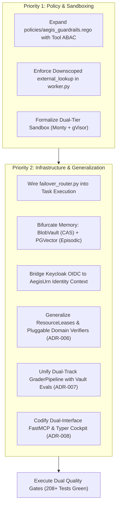

# Aegis MCP & InceptOS: Architectural Review & Gap Analysis (v0.1.0-Alpha)

**Document ID:** `ARCH-REVIEW-001`  
**Status:** RATIFIED  
**Date:** 2026-10-08  
**Scope:** Formal audit of `architecture/spec_v0-0-1-alpha.md` against operational invariants, existing production assets (`src/`), and enterprise threat models.

---

## 1. Executive Summary

`architecture/spec_v0-0-1-alpha.md` successfully establishes core agent execution governance:
- Dual-layer human inception via RFC 6902 JSON Patches (`InceptOS` $\leftrightarrow$ `Aegis Engine`).
- Monotonic state transitions on `TaskBlackboard`.
- Atomic in-memory `FileLeaseManager` with TTL eviction.
- Zero-external-dependency static AST analysis (`ASTProjector`) and Content-Addressed Storage (`BlobVault`).
- Welsh-Powell graph coloring DAG dispatch for non-conflicting parallel execution.

However, a critical review reveals **six major structural gaps and omission vectors** in the Alpha specification that would lead to security escapes, broken test benches, and regression of existing production features if implemented without remediation.

---

## 2. Core Gap Matrix: Spec vs. Production Reality

| Domain | Spec v0.1.0-Alpha Status | Production Gap / Risk | Architectural Remediation |
| :--- | :--- | :--- | :--- |
| **1. Policy Engine & ABAC** | **Section 5:** Covers filesystem containment, test locks, and forbidden imports (`subprocess`). | **Zero Tool Scoping or ABAC.** Omits actor scopes (`tools:execute`), agent tool whitelists, and argument-level bounds. | Merge filesystem guardrails with Tool ABAC into a unified dual-branch Rego policy. |
| **2. Monty "Code Mode" Scoping** | **Section 1 & 5:** Assumes Monty sandbox handles security via isolation alone. | **Unscoped Host Function Injection.** Injecting global catalog into `external_lookup` lets untrusted Python bypass ABAC. | Implement dynamic function downscoping in `worker.py` based on verified agent permissions. |
| **3. Sandbox Execution Topology** | **Section 1 & 2:** Dictates Monty Python/Rust sandbox as the sole execution engine. | **Blind to Native Test Runners.** Monty executes in-process bytecodes with no syscalls; cannot run `pytest`, `cargo`, or shell linters. | Retain dual-tier sandbox: Monty for fast in-process expressions + Ephemeral gVisor (`runsc`) for test suites. |
| **4. LLM Provider Resilience** | **Section 1 & 7:** Treats LLM completions as infallible black-box API calls. | **Vulnerable to 429 Rate Limits & Outages.** A single rate limit in a 25-turn TDD loop halts the pipeline without failover. | Wire existing `ModelFailoverRouter` (Gemini Flash $\rightarrow$ 32k $\rightarrow$ GPT-4o) with audit headers into Control Plane. |
| **5. Cross-Session Memory** | **Section 6:** Introduces flat Content-Addressed Storage (`BlobVault`) for raw diffs. | **No Semantic Episodic Memory.** Agents cannot recall successful patterns from previous solved tasks. | Retain PGVector store (`src/memory/store.py`) for cross-session episodic retrieval alongside in-session CAS blobs. |
| **6. Enterprise Identity Ingress** | **Section 3:** Assumes 4-tuple `AegisIdentityContext` arrives pre-formed. | **Lacks AuthN & Ingress Bridge.** No specification for upstream Envoy headers, Keycloak JWTs, or role mapping. | Formalize the ingress translation from Keycloak OIDC JWT claims to canonical `AgentCompositeKey` / `AegisUrn`. |
| **7. Subagent Capability Scoping & Context Typing** | **Section 9:** Raw FastMCP tool exposure without subagent inheritance boundaries or typed injection guards. | **Capability Leak & Broken Injection.** Subagents risk inheriting broad supervisor permissions; complex `Annotated`/`Union` type annotations break dynamic FastMCP schema parsing. | Adopt `SubagentSkillScoping` (allowlists/denylists) and unwrapped qualified context resolution in stub generator. |
| **8. Multi-Domain Generalization & Concurrency** | **Sections 4, 6, 7:** Hardcodes Python filesystem paths (`FileLease`), stdlib `ast`, and static conflict coloring. | **Domain Lock-In & Naive Scheduling.** Cannot govern non-code org agents (Finance, Legal, Ops); performs static mutex checks rather than speculative solution-space optimization. | Generalize `ResourceLease` URNs, pluggable `DomainVerifier` harnesses, and speculative tree search (ADR-006). |
| **9. Dual-Track Evals Architecture** | **Section 8:** Naive 4-parameter method (`evaluate_task(...)`) hardcoding Python/ruff exit codes. | **Missing EvalOps & Benchmark Harness.** Conflates inner-loop runtime task gating with offline agent capability benchmarking; lacks standardized dataset grading. | Unify runtime `GraderPipeline` with the CLI `vault` benchmark eval engine (`DeterministicVerifier`, `FormatSchema`, `Guardrail`, `SpecIntent`, `TelemetryBudget`). |
| **10. Dual-Interface Surface Architecture** | **Section 9:** Bare 4-tool snippet with zero command-line interface specifications. | **Interface Role Confusion & Blind Execution.** Fails to distinguish between autonomous LLM agent consumers (JSON-RPC) and human/CI operators (shell/POSIX); lacks lease release and targeted verifier tool primitives. | Partition into FastMCP Agent Gateway (7 tools across Concurrency, Context, Execution) and Typer Platform Cockpit (5 command groups: session, context, policy, eval, serve) (ADR-008). |

---

## 3. Deep Dive: The Core Omissions & Recommended Corrections

### Gap 1: OPA Policy Sufficiency & The Missing ABAC Layer
* **Deficiency in Spec (Section 5):** The Rego policy (`policies/aegis_guardrails.rego`) only evaluates actions `write_file`, `read_file`, and `exec_command`. It contains no logic for `call_tool`.
* **Vulnerability:** An agent unable to write to `blackboard.py` due to a file lease lock can simply call a tool like `execute_database_drop` or invoke tensor profiling with `matrix_dim = 1000000`, causing denial of service.
* **Correction Insight:** The Rego policy must evaluate a composite gate with two distinct branches:
  1. **Filesystem Gate:** Traversal check, exclusive lease matching, test modification lock, and AST import scanning.
  2. **Tool Invocation Gate (ABAC):** Verifies `tools:execute` scope, checks if `input.tool` is in `input.agent_authorized_tools`, and validates argument boundaries (e.g., `matrix_dim <= 8192`).

### Gap 2: Monty Function Scoping & Host Injection ("Code Mode")
* **Deficiency in Spec (Section 1 & 5):** The spec refers to the Monty Python/Rust engine without defining the capability boundary of host function injection.
* **Vulnerability:** Sam Colvin's core tenet for Monty is that in-process execution is only safe when external functions injected via `external_lookup` are strictly whitelisted. If the Data Plane exposes every tool in the catalog to Monty's execution namespace, an agent writing Python in "Code Mode" can execute tools that were never granted to its role.
* **Correction Insight:** `src/data_plane/worker.py` must filter the tools passed into Monty's `external_lookup` on *every execution*, matching only the subset authorized by the Control Plane's OPA decision. Unauthorized tool calls inside the sandbox must immediately raise a runtime `NameError`.

### Gap 3: The Single-Sandbox Fallacy (Monty vs. gVisor)
* **Deficiency in Spec (Section 2 & 8):** The spec lists Monty as the execution engine while Section 8 demands that `GraderPipeline` execute `pytest` and `ruff`.
* **Conflict:** Monty is an in-process Python bytecode interpreter with zero OS syscall capability. It physically cannot invoke `pytest`, run linter subprocesses, or execute binary test harnesses.
* **Correction Insight:** The architecture requires a **Dual-Tier Sandbox Engine**:
  * **Tier A (In-Process Monty):** Ultra-fast (<5ms), zero-syscall execution for safe math, data shaping, AST parsing, and scoped tool choreography.
  * **Tier B (Ephemeral gVisor Container):** Strong kernel boundary (`runsc`) with an isolated virtual filesystem for executing test suites (`pytest`), compilation (`cargo`), and package operations.

### Gap 4: LLM Failure Cascades & Missing Routing Tier
* **Deficiency in Spec (Section 3 & 4):** State machines limit turns (`turn_ceiling = 25`) and retries (`max_retries = 3`), but assume LLM inference is 100% reliable.
* **Vulnerability:** Autonomous TDD loops generate bursty token demands. A single 429 rate limit or 503 provider hiccup aborts the entire ticket, marking the session `BLOCKED` or `CANCELLED`.
* **Correction Insight:** Re-integrate the existing `src/control_plane/failover_router.py`. The Control Plane must transparently route completions through tiered fallbacks (`gemini-3.8-flash-8192` $\rightarrow$ `gemini-3.8-flash-32768` $\rightarrow$ `gpt-4o`) with exponential backoff and inject audit headers (`X-Aegis-Model-Served`, `X-Aegis-Failover-Triggered`) before the agent loop fails.

### Gap 5: Memory Architecture Bifurcation (Episodic vs. CAS)
* **Deficiency in Spec (Section 6):** The spec only provides `BlobVault` (a content-addressed SHA-256 CAS engine for raw byte slices).
* **Vulnerability:** Flat CAS allows an agent to retrieve file slices by hash, but gives zero semantic recall. The agent cannot search for prior solutions, test patterns, or architectural examples.
* **Correction Insight:** Explicitly partition memory into:
  * **L1 Artifact CAS (`src/context/blob_vault.py`):** In-session, deterministic file version snapshots, raw diffs, and AST representations referenced by `urn:aegis:blob:...`.
  * **L2 Semantic Episodic Store (`src/memory/store.py`):** Cross-session PGVector store indexing past execution episodes (`EpisodicMemoryRecord`) via cosine similarity.

### Gap 6: Identity Ingress & OIDC Claim Translation
* **Deficiency in Spec (Section 3):** The spec specifies `AegisIdentityContext` with strict regexes but provides no mechanism for how incoming HTTP requests acquire these credentials.
* **Vulnerability:** Either callers must self-assert their identity (violating zero-trust), or upstream proxies must inject untrusted headers.
* **Correction Insight:** Formalize the contract between `src/control_plane/oidc.py` and `src/control_plane/schemas.py`. Incoming requests from Envoy must validate Keycloak JWTs, extract claims (`sub`, `roles`, `groups`), and securely bind them into the immutable 4-tuple `AgentCompositeKey`.

### Gap 7: Subagent Capability Scoping & Qualified Tool Context Resolution
* **Deficiency in Spec (Section 9):** The spec defines MCP tool registration globally but omits subagent-level capability inheritance boundaries and clean typing resolution for injected host dependencies.
* **Vulnerability:**
  1. When orchestrator supervisors delegate work to specialized subagents (`@tdd-builder`, `@test-engineer`), there is no contract enforcing which tools the subagent can invoke. Subagents inherit the global tool catalog, violating least-privilege principles.
  2. Modern Python 3.12+ annotations such as `Annotated[UserContext | None, Depends(...)]` or `typing.Union` break dynamic reflection in `src/control_plane/stub_generator.py` and FastMCP argument parsers, causing internal server dependencies to leak into LLM-facing JSON schemas.
* **Correction Insight (Antigravity SDK Alignment):**
  1. Add `SubagentSkillScoping` to `AgentSpec` (`src/orchestrator/schemas.py`) with explicit `allowed_skills` and `denied_skills`. Wire this directly into OPA ABAC checks and Monty's `external_lookup` downscoping.
  2. Implement qualified context unwrapping in `src/control_plane/stub_generator.py` and `src/data_plane/dependencies.py` using `typing.get_origin()` and `typing.get_args()` to cleanly strip host dependency injection parameters from model-visible schemas.
  3. Add `register_lifecycle_hooks` on `TaskBlackboardManager` for batch registration of state machine listeners (Logfire telemetry, context health monitors, lease audits).

### Gap 8: Generalizing Beyond Software Agents (Polymorphic Leases & Verifiers)
* **Deficiency in Spec (Sections 4, 6, 7):** The spec couples the platform tightly to Python software engineering:
  1. `FileLease` assumes mutations only occur on filesystem paths.
  2. `ASTProjector` assumes Python syntax trees.
  3. `GraderPipeline` hardcodes `pytest` exit codes and `ruff` error counts.
  4. The Welsh-Powell scheduler in Section 7 performs static resource partitioning rather than active solution-space optimization (hypothesis branching).
* **Vulnerability:** The platform cannot govern general organizational agents (e.g. Finance reconciling ledgers, Legal reviewing contract clauses, Cloud Ops mutating IAM roles).
* **Correction Insight (Codified in ADR-006):**
  1. Replace `FileLease` with universal `ResourceLease` URNs (`urn:aegis:resource:<domain>:<id>`).
  2. Abstract `GraderPipeline` into pluggable domain verifiers: `DeterministicCodeVerifier`, `DeterministicSchemaVerifier`, `PolicyComplianceVerifier`.
  3. Upgrade Section 7 to speculative tree search with verifier-guided branch pruning.

### Gap 9: The Dual-Track Evals Architecture (Runtime Verifiers vs. EvalOps Benchmark Engine)
* **Deficiency in Spec (Section 8):** Section 8 defines `GraderPipeline` as a monolithic 30-line helper method taking hardcoded integers (`pytest_exit_code: int`, `ruff_violations_count: int`).
* **The Dual-Track Architecture:** Evals in production agent systems operate across two fundamentally distinct operational loops:
  1. **Inner-Loop Runtime Task Gates (In-Flight PEP):** Millisecond-latency deterministic checks evaluating a specific task run (`DeterministicVerifierGrader`, `ASTBoundaryGrader`, `TelemetryBudgetGrader`) inside the data plane.
  2. **Offline Agent Benchmark & Regression Harness (EvalOps Engine):** Cross-model, cross-prompt benchmark suites evaluating agent versions against golden task datasets (`evals/test_cases.json`).
* **Correction Insight (Codified in ADR-007):**
  - **Do NOT build a siloed, redundant third evals tool.**
  - **Do NOT introduce a heavyweight external OS evals platform** (e.g. Langfuse, Braintrust, DeepEval) into the core execution control plane, which creates vendor lock-in and network egress.
  - **Adopt the `vault` CLI Grader Architecture directly into the platform core:** The clean, modular grader chain already built in `~/vault/evals/` (`DeterministicVerifierGrader`, `FormatSchemaGrader`, `GuardrailGrader`, `SpecIntentModelGrader`, `TelemetryBudgetGrader`) serves as the SSOT evaluation engine for both:
    * In-flight task validation via `src/evaluation/grader_pipeline.py`.
    * Pre-deployment benchmark evaluation via `aegis eval run --dataset <path>`.

### Gap 10: The Dual-Interface Surface Architecture (FastMCP vs. Typer Platform Cockpit)
* **Deficiency in Spec (Section 9):** Section 9 offers four basic tool signatures for FastMCP (`aegis_acquire_lease`, `aegis_read_ast_skeleton`, `aegis_query_facet`, `aegis_slice_blob`) and a one-sentence mention of `src/interfaces/cli.py` with zero command specifications.
* **Vulnerability & Role Confusion:**
  1. Conflates two distinct operational personas: **Autonomous Agent Workers** (invoking tool primitives over JSON-RPC) and **Human Engineers / CI Operators** (driving session lifecycles, health checks, and daemon runners over POSIX shell).
  2. The agent toolset is incomplete for realistic inner loops: agents cannot explicitly release leases (`aegis_release_lease`), execute sandboxed code (`aegis_execute_code`), or trigger targeted verifiers (`aegis_run_verifier`) via MCP.
  3. The platform lacks an administrative CLI cockpit to initialize sessions, inspect blackboard state, check context health, run policy dry-runs, and launch offline benchmarks.
* **Correction Insight (Codified in ADR-008):**
  - **FastMCP Agent Gateway (`src/interfaces/mcp_server.py`):** Standardize 7 agent-facing tool primitives divided into Concurrency (`acquire_lease`, `release_lease`), Context Virtualization (`read_ast_skeleton`, `query_facet`, `slice_blob`), and Sandboxed Execution (`execute_code`, `run_verifier`) supporting both `stdio` and `SSE` transports.
  - **Typer Platform Cockpit (`src/interfaces/cli.py`):** Standardize 5 administrative command groups:
    * `aegis session [start|status|abort]` (Lifecycle & blackboard state tables)
    * `aegis context [health|compact]` ($H_{\text{ctx}}$ inspection & active compaction)
    * `aegis policy [check]` (Offline OPA dry-run with explicit diagnostic reasons)
    * `aegis eval [run]` (Golden benchmark execution with Logfire spans & CI exit codes)
    * `aegis serve [mcp|control-plane]` (Local `stdio` and network `sse` daemons)

---

## 4. Remediation Action Plan (Prioritized for Execution)

### Pre-Flight Verification Invariant
No ticket generated from `spec_v0-0-1-alpha.md` may be considered complete if it degrades or bypasses:
1. The **208 existing green unit tests**.
2. Static analysis checks (`ruff check src/`, `max-complexity <= 10`).
3. OPA policy test suites (`opa test policies/`).
4. Dual-tier execution safety (air-gapped gVisor for tests, memory-scoped Monty for scripts).
