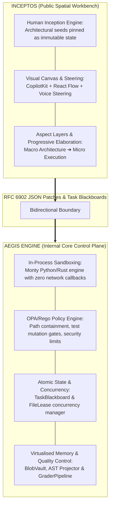
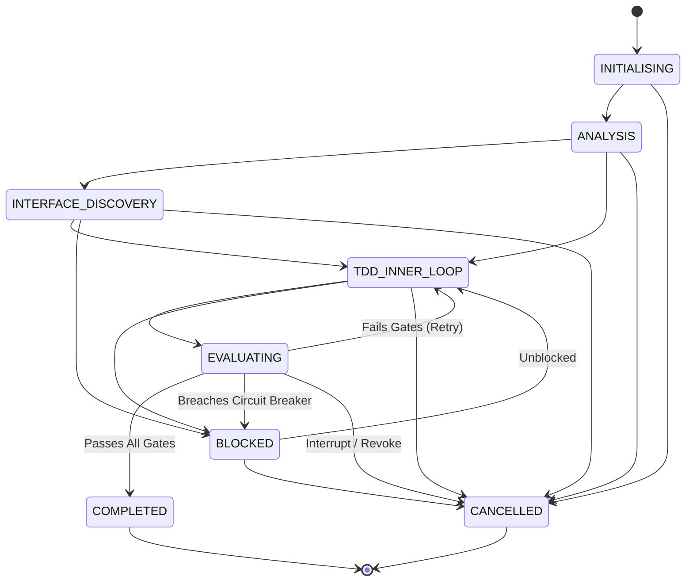
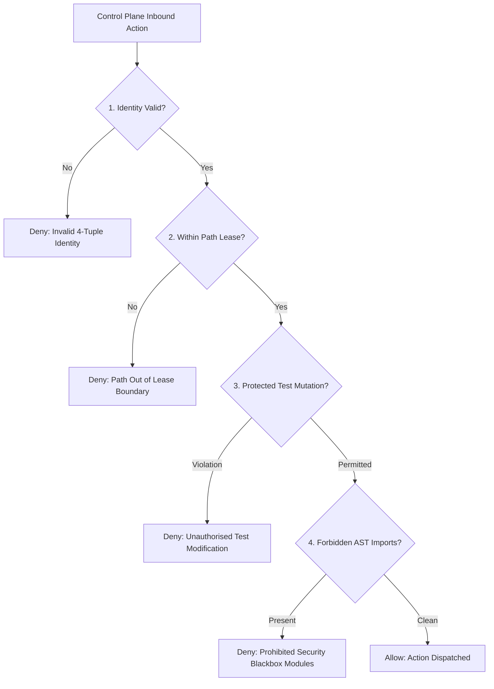

# InceptOS & Aegis Engine: Master Architecture Specification (v0.1.0-Alpha)

[](https://github.com/Tech-Battalion/aegis-mcp)
[](https://www.openpolicyagent.org/)
[](https://www.python.org/)
[](https://opensource.org/licenses/Apache-2.0)

---

## 1. System Vision & Dual-Layer Topology

**InceptOS** is an enterprise-grade, zero-trust Agentic AI platform designed to eliminate "agent entropy" and stochastic drift. It replaces unstructured text-chat loops with a human-in-the-loop spatial ideation workbench that feeds a deterministic, policy-governed execution runtime.



### Core Operating Philosophy: Human Inception

Traditional autonomous agents drift because they treat execution as an unconstrained chat generation loop. InceptOS flips this paradigm:

- **The Seed**: The human architect sets and locks the immutable architectural boundaries, AST contracts, and test invariants on the spatial canvas.
- **Deterministic Execution**: The Aegis Engine dispatches agents into bounded workspace lanes to write code within locked constraints.
- **Lossless Iteration**: AI workers materialise implementation details without modifying the top-down intent specified by the human.

---

## 2. Concrete Repository Layout & Module Namespaces

```
aegis-ai/
├── README.md
├── pyproject.toml
├── policies/
│   ├── aegis_guardrails.rego
│   └── path_containment.rego
├── src/
│   ├── control_plane/
│   │   ├── __init__.py
│   │   ├── schemas.py              # Pydantic v2 immutable domain models
│   │   ├── urn.py                  # Aegis URN parsing & validation
│   │   ├── blackboard.py           # TaskBlackboard state machine & transitions
│   │   ├── lease_manager.py        # FileLease acquisition & TTL eviction
│   │   └── scheduler.py            # BaseTaskScheduler, FIFOSingleLane, ConflictGraph
│   ├── context/
│   │   ├── __init__.py
│   │   ├── ast_projector.py        # stdlib AST skeleton extraction & complexity
│   │   ├── blob_vault.py           # Content-addressed SHA-256 CAS engine
│   │   ├── facet_index.py          # Progressive PRD/doc facet tree index
│   │   └── health_monitor.py       # Context Health Index (H_ctx) telemetry
│   ├── security/
│   │   ├── __init__.py
│   │   ├── opa_client.py           # Open Policy Agent Wasm / Rego evaluator
│   │   └── monty_bridge.py         # Rust/Python in-process sandbox interface
│   ├── evaluation/
│   │   ├── __init__.py
│   │   ├── grader_pipeline.py      # 4-Tier evaluation coordinator
│   │   ├── deterministic.py        # Tier 1: pytest & ruff verifiers
│   │   ├── ast_complexity.py       # Tier 2: Cyclomatic complexity & boundary checks
│   │   ├── spec_intent.py          # Tier 3: LLM rubric evaluator
│   │   └── telemetry_budget.py     # Tier 4: Token & turn budget gates
│   └── interfaces/
│       ├── __init__.py
│       ├── mcp_server.py           # FastMCP stdio/SSE gateway implementation
│       └── cli.py                  # Typer CLI application (inceptos / aegis commands)
└── tests/
    ├── unit/
    ├── integration/
    └── benchmarks/
```

---

## 3. Pydantic v2 Domain Schemas

Source location: `src/control_plane/schemas.py`

```python
from datetime import datetime, timezone
import re
from typing import Annotated, Any, Literal
from enum import Enum
from pydantic import (
    BaseModel,
    ConfigDict,
    Field,
    GetCoreSchemaHandler,
    field_validator,
    model_validator,
)
from pydantic_core import CoreSchema, core_schema


class AegisUrn(str):
    """Canonical Uniform Resource Name for Aegis platform entity identification.

    Pattern: urn:aegis:<entity_type>:<namespace>:<identifier>
    Example: urn:aegis:session:core:550e8400-e29b-41d4-a716-446655440000
    """
    URN_REGEX = re.compile(
        r"^urn:aegis:(session|blob|agent|lease|task|facet):[a-z0-9_-]+:[a-f0-9-]+$"
    )

    @classmethod
    def __get_pydantic_core_schema__(
        cls, source_type: Any, handler: GetCoreSchemaHandler
    ) -> CoreSchema:
        return core_schema.no_info_after_validator_function(
            cls.validate,
            core_schema.str_schema(),
        )

    @classmethod
    def validate(cls, value: str) -> "AegisUrn":
        if not isinstance(value, str):
            raise TypeError("AegisUrn must be a string")
        if not cls.URN_REGEX.match(value):
            raise ValueError(
                f"Invalid Aegis URN format: '{value}'. "
                "Must match 'urn:aegis:<entity_type>:<namespace>:<uuid_or_hash>'"
            )
        return cls(value)


class AegisIdentityContext(BaseModel):
    """4-Tuple Identity Context attached to every incoming execution payload."""
    model_config = ConfigDict(extra="forbid", frozen=True)

    actor_id: str = Field(..., min_length=3, description="Human user or external caller handle")
    agent_id: str = Field(..., min_length=3, description="Assigned worker agent identifier")
    cost_centre_id: str = Field(..., pattern=r"^[A-Z0-9_]{3,16}$", description="Billing unit code")
    session_id: AegisUrn = Field(..., description="Active session URN reference")


class FileLease(BaseModel):
    """Exclusive or shared path lease model enforcing state mutation boundaries."""
    model_config = ConfigDict(extra="forbid", frozen=True)

    lease_urn: AegisUrn
    file_path: str = Field(..., min_length=1)
    owner_agent_id: str
    acquired_at: datetime
    expires_at: datetime
    is_exclusive: bool = True
    allow_test_mutation: bool = False

    @model_validator(mode="after")
    def validate_expiration_window(self) -> "FileLease":
        if self.expires_at <= self.acquired_at:
            raise ValueError("expires_at timestamp must be strictly greater than acquired_at")
        return self


class ExecutionPhase(str, Enum):
    INITIALISING = "INITIALISING"
    ANALYSIS = "ANALYSIS"
    INTERFACE_DISCOVERY = "INTERFACE_DISCOVERY"
    TDD_INNER_LOOP = "TDD_INNER_LOOP"
    EVALUATING = "EVALUATING"
    COMPLETED = "COMPLETED"
    BLOCKED = "BLOCKED"
    CANCELLED = "CANCELLED"


class TaskBlackboard(BaseModel):
    """Atomic session state blackboard model enforcing structural execution boundaries."""
    model_config = ConfigDict(extra="forbid", frozen=True)

    session_urn: AegisUrn
    canvas_session_id: str | None = None
    identity: AegisIdentityContext
    goal: str = Field(..., min_length=10, max_length=2000)
    state: ExecutionPhase = ExecutionPhase.INITIALISING
    target_files: tuple[str, ...] = Field(
        ..., min_length=1, max_length=5, description="Bounded modification paths"
    )
    active_leases: tuple[FileLease, ...] = ()
    current_turn: Annotated[int, Field(ge=0)] = 0
    turn_ceiling: Annotated[int, Field(ge=1, le=50)] = 25
    retry_count: Annotated[int, Field(ge=0)] = 0
    max_retries: Annotated[int, Field(ge=1, le=5)] = 3
    ast_invariant_hashes: tuple[str, ...] = ()

    @field_validator("target_files")
    @classmethod
    def validate_relative_paths(cls, paths: tuple[str, ...]) -> tuple[str, ...]:
        for path in paths:
            if path.startswith("/") or ".." in path:
                raise ValueError(f"Path '{path}' must be a normalised relative workspace path")
        return paths


class ASTSymbolDigest(BaseModel):
    """Distilled representation of a source file's code structure."""
    model_config = ConfigDict(extra="forbid", frozen=True)

    file_path: str
    classes: tuple[str, ...]
    function_signatures: tuple[str, ...]
    imports: tuple[str, ...]
    cyclomatic_complexity_max: Annotated[int, Field(ge=1)]
    raw_sha256: str = Field(..., pattern=r"^[a-f0-9]{64}$")


class ContextHealthReport(BaseModel):
    """Real-time Context Health Index (H_ctx) telemetry payload."""
    model_config = ConfigDict(extra="forbid", frozen=True)

    session_urn: AegisUrn
    active_token_count: Annotated[int, Field(ge=0)]
    saturation_ratio: Annotated[float, Field(ge=0.0, le=1.0)]
    signal_to_noise_ratio: Annotated[float, Field(ge=0.0, le=1.0)]
    state_drift_ratio: Annotated[float, Field(ge=0.0, le=1.0)]
    health_score: Annotated[float, Field(ge=0.0, le=1.0)]
    active_blob_count: Annotated[int, Field(ge=0)]
    is_compaction_required: bool
```

---

## 4. State Machine & Concurrency Control

### Transition Validation State Machine



### Transition Validation Matrix

```python
VALID_TRANSITIONS: dict[ExecutionPhase, set[ExecutionPhase]] = {
    ExecutionPhase.INITIALISING: {
        ExecutionPhase.ANALYSIS,
        ExecutionPhase.CANCELLED,
    },
    ExecutionPhase.ANALYSIS: {
        ExecutionPhase.INTERFACE_DISCOVERY,
        ExecutionPhase.TDD_INNER_LOOP,
        ExecutionPhase.CANCELLED,
    },
    ExecutionPhase.INTERFACE_DISCOVERY: {
        ExecutionPhase.TDD_INNER_LOOP,
        ExecutionPhase.BLOCKED,
        ExecutionPhase.CANCELLED,
    },
    ExecutionPhase.TDD_INNER_LOOP: {
        ExecutionPhase.EVALUATING,
        ExecutionPhase.BLOCKED,
        ExecutionPhase.CANCELLED,
    },
    ExecutionPhase.EVALUATING: {
        ExecutionPhase.COMPLETED,
        ExecutionPhase.TDD_INNER_LOOP,
        ExecutionPhase.BLOCKED,
        ExecutionPhase.CANCELLED,
    },
    ExecutionPhase.COMPLETED: set(),
    ExecutionPhase.BLOCKED: {
        ExecutionPhase.TDD_INNER_LOOP,
        ExecutionPhase.CANCELLED,
    },
    ExecutionPhase.CANCELLED: set(),
}
```

### Async Concurrent Lock Engine

Source location: `src/control_plane/lease_manager.py`

```python
import asyncio
from datetime import datetime, timezone, timedelta
from src.control_plane.schemas import FileLease, AegisUrn


class LeaseConflictError(Exception):
    def __init__(self, requested_path: str, active_lease: FileLease):
        self.requested_path = requested_path
        self.active_lease = active_lease
        super().__init__(
            f"Path '{requested_path}' locked by owner '{active_lease.owner_agent_id}' "
            f"until {active_lease.expires_at.isoformat()}"
        )


class FileLeaseManager:
    """In-memory atomic file lock engine with automatic TTL eviction."""

    def __init__(self) -> None:
        self._lock = asyncio.Lock()
        self._active_leases: dict[str, FileLease] = {}

    async def acquire_leases(
        self,
        agent_id: str,
        file_paths: tuple[str, ...],
        ttl_seconds: int = 300,
        allow_test_mutation: bool = False,
    ) -> tuple[FileLease, ...]:
        async with self._lock:
            now = datetime.now(timezone.utc)
            self._evict_stale_leases(now)

            # Pre-check for conflicts across all requested paths
            for path in file_paths:
                if path in self._active_leases:
                    existing = self._active_leases[path]
                    if existing.owner_agent_id != agent_id:
                        raise LeaseConflictError(path, existing)

            # Grant atomic leases
            acquired: list[FileLease] = []
            expires_at = now + timedelta(seconds=ttl_seconds)

            for path in file_paths:
                lease_id_hash = hash(f"{agent_id}:{path}:{now.isoformat()}") & 0xFFFFFFFF
                lease = FileLease(
                    lease_urn=AegisUrn(f"urn:aegis:lease:core:{lease_id_hash:08x}"),
                    file_path=path,
                    owner_agent_id=agent_id,
                    acquired_at=now,
                    expires_at=expires_at,
                    is_exclusive=True,
                    allow_test_mutation=allow_test_mutation,
                )
                self._active_leases[path] = lease
                acquired.append(lease)

            return tuple(acquired)

    async def release_leases(self, agent_id: str, file_paths: tuple[str, ...]) -> None:
        async with self._lock:
            for path in file_paths:
                if path in self._active_leases:
                    if self._active_leases[path].owner_agent_id == agent_id:
                        del self._active_leases[path]

    def _evict_stale_leases(self, now: datetime) -> None:
        expired_paths = [
            path for path, lease in self._active_leases.items()
            if lease.expires_at <= now
        ]
        for path in expired_paths:
            del self._active_leases[path]
```

---

## 5. Zero-Trust Security & OPA Policy Engine

Source location: `policies/aegis_guardrails.rego`

### Policy Evaluation Pipeline



### Rego Policy Source

```rego
package aegis.security.guardrails

import future.keywords.in

default allow = false

# Context Inputs expected from Control Plane:
# input.identity = {"actor_id": "...", "agent_id": "...", "cost_centre_id": "...", "session_id": "..."}
# input.action   = "write_file" | "read_file" | "exec_command"
# input.target_path = "src/control_plane/blackboard.py"
# input.lease = {"is_exclusive": true, "allow_test_mutation": false, "file_path": "..."}
# input.ast_imports = ["os", "sys", "subprocess"]

# 1. Main Authorisation Gate
allow {
    is_identity_valid
    is_path_within_lease
    not violates_test_protection
    not contains_forbidden_imports
}

# 2. Check 4-Tuple Identity Context Integrity
is_identity_valid {
    input.identity.actor_id != ""
    input.identity.agent_id != ""
    re_match("^[A-Z0-9_]{3,16}$", input.identity.cost_centre_id)
    re_match("^urn:aegis:session:[a-z0-9_-]+:[a-f0-9-]+$", input.identity.session_id)
}

# 3. Path Containment Check
is_path_within_lease {
    not startswith(input.target_path, "/")
    not contains(input.target_path, "..")
    input.target_path == input.lease.file_path
}

# 4. Protected Test Mutation Guardrail
violates_test_protection {
    startswith(input.target_path, "tests/")
    input.action == "write_file"
    input.lease.allow_test_mutation == false
}

# 5. Forbidden AST Imports Guardrail
forbidden_import_blackbox := ["subprocess", "pty", "socket", "ctypes"]

contains_forbidden_imports {
    some imp in input.ast_imports
    imp in forbidden_import_blackbox
}
```

---

## 6. Context Engineering & Memory Virtualisation

### AST Skeleton Projector

Source location: `src/context/ast_projector.py`

```python
import ast
from typing import Tuple
from src.control_plane.schemas import ASTSymbolDigest


class CyclomaticComplexityVisitor(ast.NodeVisitor):
    def __init__(self) -> None:
        self.complexity: int = 1

    def visit_If(self, node: ast.If) -> None:
        self.complexity += 1
        self.generic_visit(node)

    def visit_For(self, node: ast.For) -> None:
        self.complexity += 1
        self.generic_visit(node)

    def visit_While(self, node: ast.While) -> None:
        self.complexity += 1
        self.generic_visit(node)

    def visit_ExceptHandler(self, node: ast.ExceptHandler) -> None:
        self.complexity += 1
        self.generic_visit(node)

    def visit_BoolOp(self, node: ast.BoolOp) -> None:
        self.complexity += len(node.values) - 1
        self.generic_visit(node)


class ASTProjector:
    """Extracts type signatures and measures structural metrics using stdlib ast."""

    @staticmethod
    def extract_digest(file_path: str, source_code: str, sha256_hex: str) -> ASTSymbolDigest:
        tree = ast.parse(source_code)
        
        classes: list[str] = []
        function_sigs: list[str] = []
        imports: list[str] = []
        max_complexity: int = 1

        for node in ast.walk(tree):
            if isinstance(node, ast.ClassDef):
                classes.append(node.name)
            elif isinstance(node, (ast.FunctionDef, ast.AsyncFunctionDef)):
                args = [a.arg for a in node.args.args]
                sig = f"{node.name}({', '.join(args)})"
                if node.returns:
                    sig += f" -> {ast.unparse(node.returns)}"
                function_sigs.append(sig)
                
                cc_visitor = CyclomaticComplexityVisitor()
                cc_visitor.visit(node)
                if cc_visitor.complexity > max_complexity:
                    max_complexity = cc_visitor.complexity
            elif isinstance(node, ast.Import):
                for alias in node.names:
                    imports.append(alias.name)
            elif isinstance(node, ast.ImportFrom):
                if node.module:
                    imports.append(node.module)

        return ASTSymbolDigest(
            file_path=file_path,
            classes=tuple(sorted(classes)),
            function_signatures=tuple(sorted(function_sigs)),
            imports=tuple(sorted(set(imports))),
            cyclomatic_complexity_max=max_complexity,
            raw_sha256=sha256_hex,
        )
```

### Content-Addressed Vault

Source location: `src/context/blob_vault.py`

```python
import hashlib
from pathlib import Path
from src.control_plane.schemas import AegisUrn


class ContentAddressedBlobVault:
    """Local CAS storing payload blobs referenced by SHA-256 content hashes."""

    def __init__(self, base_dir: Path = Path(".aegis/blobs")) -> None:
        self.base_dir = base_dir
        self.base_dir.mkdir(parents=True, exist_ok=True)

    def store(self, content: bytes) -> AegisUrn:
        sha256_hash = hashlib.sha256(content).hexdigest()
        prefix, remainder = sha256_hash[:2], sha256_hash[2:]
        
        dir_path = self.base_dir / prefix
        dir_path.mkdir(exist_ok=True)
        file_path = dir_path / f"{remainder}.blob"

        if not file_path.exists():
            file_path.write_bytes(content)

        return AegisUrn(f"urn:aegis:blob:core:{sha256_hash}")

    def retrieve_slice(self, urn: AegisUrn, offset: int = 0, length: int = 2000) -> str:
        sha256_hash = urn.split(":")[-1]
        prefix, remainder = sha256_hash[:2], sha256_hash[2:]
        file_path = self.base_dir / prefix / f"{remainder}.blob"

        if not file_path.exists():
            raise FileNotFoundError(f"Blob content for URN '{urn}' not found")

        with file_path.open("rb") as f:
            f.seek(offset)
            chunk = f.read(length)
            return chunk.decode("utf-8", errors="replace")
```

### Context Health Index Equation ($H_{\text{ctx}}$)

$$H_{\text{ctx}} = 1.0 - \left[ 0.40 \left(\frac{T_{\text{active}}}{T_{\text{ceiling}}}\right) + 0.40 \left(1.0 - \frac{T_{\text{AST}} + T_{\text{diff}}}{T_{\text{active}}}\right) + 0.20 \left(\frac{N_{\text{out\_lease}}}{N_{\text{total}}}\right) \right]$$

- **Compaction Trigger**: Executed automatically whenever $H_{\text{ctx}} < 0.70$ or token saturation exceeds $80\%$.

---

## 7. Parallel Scheduling & Conflict Graph Engine

### Welsh-Powell Graph Coloring Scheduler

Source location: `src/control_plane/scheduler.py`

```python
from abc import ABC, abstractmethod
from src.control_plane.schemas import TaskBlackboard, FileLease


class BaseTaskScheduler(ABC):
    @abstractmethod
    async def dispatch_task(self, goal: str, target_files: tuple[str, ...]) -> TaskBlackboard:
        pass

    @abstractmethod
    async def release_lease(self, session_urn: str, file_path: str) -> None:
        pass


class FIFOSingleLaneScheduler(BaseTaskScheduler):
    """Week 1 MVP Scheduler: Sequential FIFO execution with in-memory locks."""
    
    async def dispatch_task(self, goal: str, target_files: tuple[str, ...]) -> TaskBlackboard:
        # MVP Implementation: Single-lane sequential execution
        ...

    async def release_lease(self, session_urn: str, file_path: str) -> None:
        ...


class ConflictGraphDAGScheduler(BaseTaskScheduler):
    """Post-Alpha Engine: Welsh-Powell graph-coloring parallel queue dispatcher."""

    def partition_into_parallel_queues(self, tasks: list[TaskBlackboard]) -> list[list[TaskBlackboard]]:
        # 1. Build adjacency list for conflict graph G = (V, E)
        adjacency: dict[str, set[str]] = {t.session_urn: set() for t in tasks}
        task_map = {t.session_urn: t for t in tasks}

        for i, t1 in enumerate(tasks):
            for t2 in tasks[i + 1:]:
                if set(t1.target_files).intersection(set(t2.target_files)):
                    adjacency[t1.session_urn].add(t2.session_urn)
                    adjacency[t2.session_urn].add(t1.session_urn)

        # 2. Sort vertices by degree descending
        sorted_nodes = sorted(
            adjacency.keys(), key=lambda node: len(adjacency[node]), reverse=True
        )

        # 3. Color nodes (assign non-conflicting tasks to parallel queues)
        color_map: dict[str, int] = {}
        current_color = 0

        for node in sorted_nodes:
            if node in color_map:
                continue
            color_map[node] = current_color
            for other_node in sorted_nodes:
                if other_node not in color_map:
                    # Check if other_node conflicts with any node in current_color group
                    if not any(other_node in adjacency[colored_node] 
                               for colored_node, col in color_map.items() if col == current_color):
                        color_map[other_node] = current_color

            current_color += 1

        # 4. Group tasks by assigned queue color
        queues: dict[int, list[TaskBlackboard]] = {}
        for node, color in color_map.items():
            queues.setdefault(color, []).append(task_map[node])

        return [queues[col] for col in sorted(queues.keys())]
```

---

## 8. Quality Control Pipeline

Source location: `src/evaluation/grader_pipeline.py`

```python
from typing import NamedTuple
from src.control_plane.schemas import TaskBlackboard, ASTSymbolDigest


class EvaluationResult(NamedTuple):
    passed: bool
    failing_tier: str | None
    error_message: str | None


class GraderPipeline:
    """Post-flight validation pipeline executing binary evaluation gates."""

    async def evaluate_task(
        self,
        blackboard: TaskBlackboard,
        ast_digest: ASTSymbolDigest,
        pytest_exit_code: int,
        ruff_violations_count: int,
        prompt_intent_score: float,
    ) -> EvaluationResult:
        
        # Tier 1: Deterministic Verifiers
        if ruff_violations_count > 0:
            return EvaluationResult(False, "TIER_1_RUFF", f"Found {ruff_violations_count} formatting violations")
        if pytest_exit_code != 0:
            return EvaluationResult(False, "TIER_1_PYTEST", f"Pytest failed with exit code {pytest_exit_code}")

        # Tier 2: AST Complexity Boundary
        if ast_digest.cyclomatic_complexity_max > 10:
            return EvaluationResult(
                False, "TIER_2_AST",
                f"Cyclomatic complexity {ast_digest.cyclomatic_complexity_max} exceeds threshold (<=10)"
            )

        # Tier 3: Spec Intent Model Grader
        if prompt_intent_score < 0.85:
            return EvaluationResult(
                False, "TIER_3_INTENT",
                f"Prompt intent fulfillment score {prompt_intent_score:.2f} below threshold (0.85)"
            )

        # Tier 4: Telemetry Budget Gate
        if blackboard.current_turn > blackboard.turn_ceiling:
            return EvaluationResult(
                False, "TIER_4_BUDGET",
                f"Turn count {blackboard.current_turn} exceeded ceiling {blackboard.turn_ceiling}"
            )

        return EvaluationResult(True, None, None)
```

---

## 9. Interface Contracts & API Gateways

### FastMCP Tool Gateways

Source location: `src/interfaces/mcp_server.py`

```python
from mcp.server.fastmcp import FastMCP
from src.control_plane.schemas import AegisUrn

mcp = FastMCP("InceptOS-Aegis-Control-Plane")


@mcp.tool()
async def aegis_acquire_lease(
    agent_id: str,
    file_paths: list[str],
    ttl_seconds: int = 300,
) -> str:
    """Acquires exclusive atomic file locks for specified workspace paths."""
    ...


@mcp.tool()
async def aegis_read_ast_skeleton(file_path: str) -> str:
    """Returns the AST class and function skeleton digest of a target file."""
    ...


@mcp.tool()
async def aegis_query_facet(facet_name: str) -> str:
    """Queries the progressive Facet Tree Index for PRD or architecture specs."""
    ...


@mcp.tool()
async def aegis_slice_blob(blob_urn: str, offset: int = 0, length: int = 2000) -> str:
    """Retrieves a text slice from the Content-Addressed Blob Vault."""
    ...
```

---

## 10. Implementation Plan & Agent Ticket Backlog

The following backlog defines the sequential tasks for the agent execution pipeline:

| Ticket ID | Module Path | Target Scope | Key Acceptance Criteria |
| :--- | :--- | :--- | :--- |
| **TICK-001** | `src/control_plane/schemas.py` | Data Models | Implement `AegisUrn`, `FileLease`, and `TaskBlackboard` with `extra="forbid"`, `frozen=True`. |
| **TICK-002** | `src/context/blob_vault.py` | Blob Vault | Build content-addressed SHA-256 CAS engine with `store()` and `retrieve_slice()`. |
| **TICK-003** | `src/context/ast_projector.py` | AST Projector | Build stdlib AST projector with `CyclomaticComplexityVisitor`. |
| **TICK-004** | `policies/aegis_guardrails.rego` | Security Rules | Write Rego policy enforcing path containment and forbidden import blocks. |
| **TICK-005** | `src/security/monty_bridge.py` | Sandbox Bridge | Implement Monty Rust/Python bridge with whitelisted host callbacks. |
| **TICK-006** | `src/control_plane/lease_manager.py` | Concurrency Lock | Implement async `FileLeaseManager` with lock conflicts and TTL eviction. |
| **TICK-007** | `src/control_plane/blackboard.py` | State Machine | Implement `TaskBlackboardManager` enforcing valid phase transitions. |
| **TICK-008** | `src/control_plane/scheduler.py` | Task Scheduler | Implement `BaseTaskScheduler` and `FIFOSingleLaneScheduler`. |
| **TICK-009** | `src/context/health_monitor.py` | Telemetry Engine | Implement $H_{\text{ctx}}$ context health calculation and compaction triggers. |
| **TICK-010** | `src/evaluation/grader_pipeline.py` | Evals Pipeline | Build `GraderPipeline` coordinator checking Tiers 1 through 4. |
| **TICK-011** | `src/interfaces/mcp_server.py` | FastMCP Server | Expose `aegis_acquire_lease`, `aegis_read_ast_skeleton`, and `aegis_slice_blob`. |
| **TICK-012** | `src/interfaces/cli.py` | Typer CLI | Build `inceptos run` and `inceptos status` CLI interface commands. |
